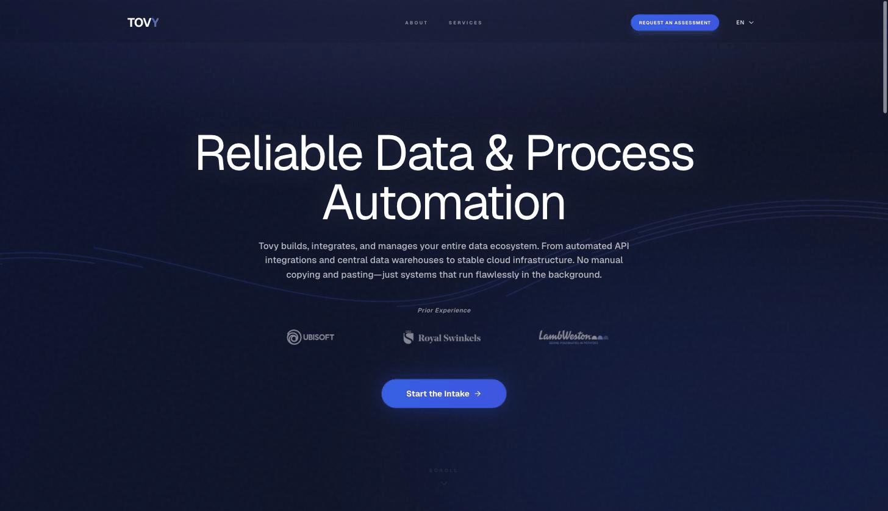
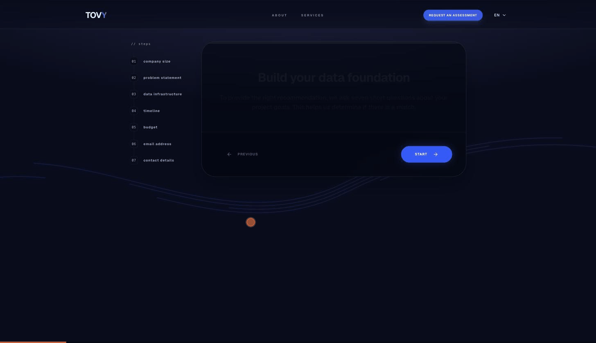

# Tovy

Marketing and lead-generation site for [**Tovy**](https://www.tovy.eu) — a data
engineering and AI consultancy. A statically-exported, multilingual Next.js app
backed by a serverless Firebase stack for lead capture, scoring, and automated
follow-up.

**Live:** https://www.tovy.eu




## Overview

A high-performance static site optimised for SEO and AI discoverability, with a
lightweight serverless backend. Visitors move through a multi-step intake flow;
qualified leads are scored, persisted, and routed, with automated recovery and
admin alerting handled by Cloud Functions.

### Lead intake flow



## Architecture

- **Static generation** — Next.js 15 App Router with `output: 'export'`; four
  pre-rendered locales (`en`, `nl`, `es`, `de`) on isolated route segments.
- **Edge delivery** — Firebase Hosting CDN with immutable cache headers; raw
  static HTML for full search-engine and LLM indexability.
- **Direct-to-Firestore** — clients write via the Firebase Client SDK, secured
  at the network boundary by `firestore.rules` (no client reads, email
  validation) — no custom backend layer.
- **Serverless workflows** — Cloud Functions handle scheduled abandoned-lead
  recovery and real-time admin notifications.

## Features

- **Lead qualification** — 7-step intake with domain checks, real-time client
  scoring, and path routing (high-fit vs. nurture).
- **Automated recovery** — cron Cloud Function requeues localized reminder
  emails for forms abandoned > 2h.
- **Real-time alerting** — Firestore document listeners notify the team on new
  leads via `ntfy.sh`.
- **Structured data** — automated JSON-LD (Organization, Services, FAQPage,
  BreadcrumbList) for search and AI indexing.
- **GDPR consent** — client-side cookie-consent banner that gates tracking.

## Tech stack

Next.js 15 (React 19) · TypeScript · Tailwind CSS · Framer Motion ·
React Hook Form + Zod · Firebase (Hosting, Firestore, Functions, Extensions) ·
Google Analytics 4

## Getting started

```bash
npm install       # install dependencies
npm run dev       # start dev server (http://localhost:9002)
npm run typecheck # tsc --noEmit
npm run lint      # eslint
npm test          # vitest
```

## CI/CD

GitHub Actions pipeline with keyless Google Cloud auth via Workload Identity
Federation:

- Typecheck, lint, and build run on every push and pull request.
- Pull requests deploy to a temporary 7-day Firebase preview channel.
- Merges to `main` build the static export and deploy to production.

## License

All rights reserved. © 2026 Tovy.
